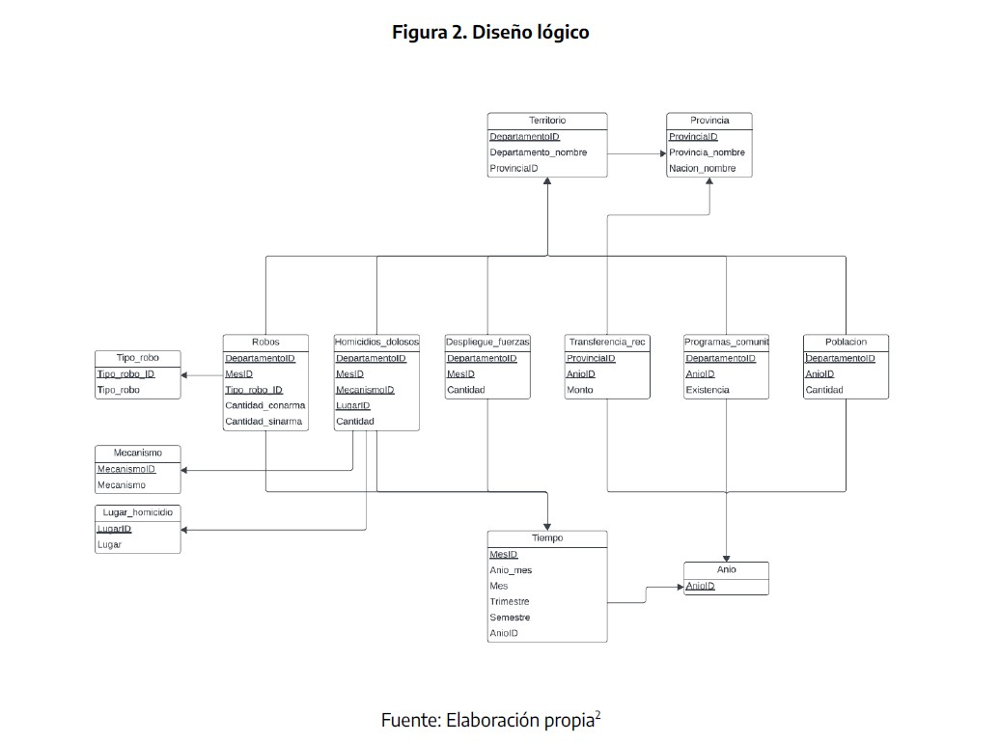

# Data Warehouse: Análisis de Criminalidad en Argentina (SNIC) 🇦🇷⚖️

## 📌 Descripción del Proyecto
Este proyecto consiste en el diseño y arquitectura de un **Data Warehouse** basado en los datos del **Sistema Nacional de Información Criminal (SNIC)**. El objetivo es transformar datos operativos (OLTP) en un modelo analítico (OLAP) para la toma de decisiones en políticas de seguridad pública.

El sistema permite analizar tendencias de criminalidad, identificar zonas críticas y evaluar el impacto de variables externas como el despliegue de fuerzas federales y transferencias presupuestarias.

## 🎯 Objetivos de Negocio
- **Monitoreo de delitos:** Evolución de homicidios dolosos y robos a nivel nacional y provincial.
- **Geolocalización del crimen:** Identificación de departamentos con mayor incidencia delictiva.
- **Evaluación de Impacto:** Correlación entre el despliegue de fuerzas de seguridad/inversión y la variación de los índices de criminalidad.

## 🏗️ Arquitectura y Diseño
El proyecto sigue una arquitectura de Data Warehouse con un modelo desnormalizado optimizado para consultas complejas.

### Diseño Lógico (Star Schema / Snowflake)
El modelo se estructuró mediante tablas de hechos y dimensiones:
- **Tablas de Hechos:** `Robos`, `Homicidios_Dolosos`, `Despliegue_Fuerzas`, `Transferencia_Rec`, `Programas_Comunitarios` y `Poblacion`.
- **Dimensiones:** `Territorio` (Nación, Provincia, Departamento), `Tiempo` (Año, Mes, Trimestre, Semestre), `Mecanismo`, `Lugar_Homicidio` y `Tipo_Robo`.

> 

## 🛠️ Tecnologías Utilizadas
- **Lenguaje:** SQL (PostgreSQL).
- **Modelado de Datos:** LucidChart.
- **Documentación:** Informe Técnico PDF.

## 📊 Principales Indicadores (KPIs)
1. **Tasa de Homicidios/Robos cada 100k habitantes:** Segmentada por territorio y tiempo.
2. **Evolución Mensual:** Comparativa de delitos con vs. sin uso de armas.
3. **Análisis de Inversión:** Impacto de transferencias presupuestarias en la reducción del delito.

## 🔍 Ejemplo de Consulta Analítica
El repositorio incluye scripts para el cálculo automático de tasas. Ejemplo de lógica aplicada:
```sql
-- Cálculo de tasa de robos cada 100.000 habitantes por departamento
SELECT t.departamento_nombre, 
       (SUM(r.cantidad_conarma + r.cantidad_sinarma) * 100000.0 / p.cantidad) as tasa_robos
FROM robos r
JOIN territorio t ON r.departamento_id = t.departamento_id
... (ver sql_scripts/4_consultas_analiticas.sql para el detalle)
